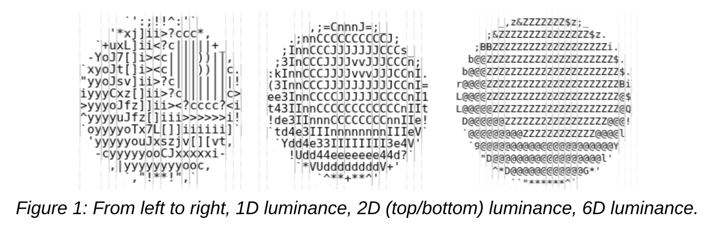

<!--05-04-2026-->
<!--PUBLISH-->

May 04, 2026

# Ascii-based Rendering
For my graphics final project, my partner *Eva Nance* and I implemented ascii-based rendering hugely inspired by [this blog post](https://alexharri.com/blog/ascii-rendering). 

I really loved the demos and explanation this provided, so go check out the original author Alex Harri!

## Links
- [Repo link](https://github.com/IshDeshpa/ascii)
- [Demo link](https://ishdeshpa.com/ascii)

-----
## Graphics Final Project Report
### Goal
The goal of our project was to create an ASCII art renderer, based off of this blog post. We wanted to be able to algorithmically convert any image into ASCII art. Additionally, we wanted to demonstrate the difference between sampling a given frame at different text sizes, subcell resolutions, fonts, and gradients. 

### Key Algorithms and Components
To convert an image into ASCII art, you first divide the frame into a grid of cells, each the size of a character in the target font. Then, choosing which ASCII character belongs in each cell is a matter of determining which character aligns best with that portion of the frame. The most straightforward way to do this is by sampling each pixel in a cell and averaging their RGB values to obtain the average brightness of the cell, then selecting an ASCII character with the closest average brightness. This works well, but lacks fine-grained fidelity: as seen in Figure 1, it effectively reduces the resolution of the image to cell-sized pixels and ignores the fact that each ASCII character has a distinct shape.
To exploit the shape of each character and create a more faithful representation of the image, we can split each cell into two subcells: a top and a bottom subcell. Before rendering, we take each ASCII character, determine the density of pixels in the top and bottom halves, and store that information in a 2D vector associated with it. Then, during rendering, we measure the brightness of the top and bottom subcells and compare these values to the ASCII characters’ 2D vectors, selecting the character with the most similar shape.
We can extend this idea to six dimensions by dividing each cell into top-left, top-right, middle-left, middle-right, bottom-left, and bottom-right subcells. This helps differentiate between letters like ‘p’ and ‘q’ (which have the same vertical distribution but different left/right distributions), as well as ‘_’, ‘-’, and ‘^’ (which have similar left/right distributions but different top/middle/bottom distributions).

Additionally, to increase contrast, we exponentiate the brightness values of each subcell in the ASCII map. This ensures that darker image values do not all map to the darkest ASCII character. We also normalize our ASCII map, since the smallest character (space) has zero pixels of ink, whereas the largest character (‘@’) has ink on only about half of its pixels.

### Mathematical Background
To find the ASCII character most similar to a given cell, we calculate the distance between the cell’s brightness vector and each character’s brightness vector. The character that yields the smallest distance is chosen. For 2D, this is: dist(vecA, vecB) = √((vecA.x - vecB.x)2 + (vecA.y - vecB.y)2). This extends to an n-dimensional vector like so: dist(vecA, vecB) = √((vecA[0] - vecB[0])2 + … + (vecA[n-1] - vecB[n-1])2).

### Implementation
To implement our ASCII art renderer, we first built a basic animation engine that accepted arbitrary “Geometries” and some camera/light position. This is the first and second animation options; the bouncing sphere/cube/cone and the solar system.
An “Animation” is an encapsulation of some draw function and update function; the draw function does the rendering (updating attributes, uniforms, all the GL calls) and the update function does the movement of geometries (running on some specified setInterval). Our Animations include the ShapeAnimation, the SpaceAnimation, and the VideoAnimation.  The VideoAnimation hardwires a specific render target to be the output of some user-uploaded video.
A “Program” is the encapsulation of an OpenGL program (similar to RenderPass). A “RenderTarget” is some intermediate buffer that is written to between chains of programs. We have two main types of Programs, ones that produce some output to a RenderTarget and ones that operate as a filter on some RenderTarget.
For example, a GeometryProgram is all the involved data structures that track the vertices, normals, and indices of several different geometries and render it to some RenderTarget while an AsciiProgram or a SliderProgram is just a subclass of FXProgram, or just some overlay upon an existing RenderTarget that spits out a new RenderTarget.
The Font class handles the construction of the textures to be passed into the AsciiProgram’s fragment shader. We first sample every ASCII character by rendering it to a separate canvas, noting its luminance characteristics as a 1D, 2D, or 6D vector (depending on the version selected). These vectors are passed into the fragment shader as a texture and a comparison function is used to select the vector best matching a particular cell of pixels.
The main Ascii class handles any keyboard/HTML inputs and redirects them to the active animation. It also handles reconstructing the Font class every time the version changes, the invert button gets clicked, or the font/font size changes. Buttons 1, 2, and 3 can be pressed to switch between the geometries, solar system, and video animations. Versions 1, 2, and 3 will switch both the font and the shader being used in the AsciiProgram.

-----

Thanks for reading! Big shoutout to Prof. Vouga.
