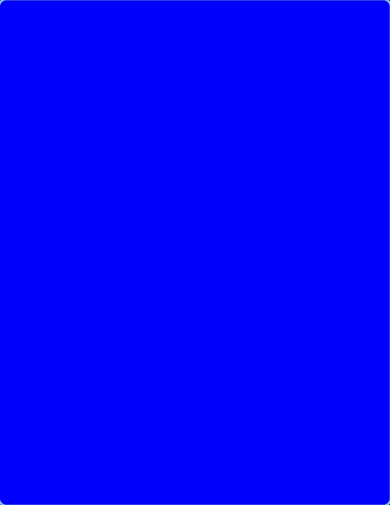
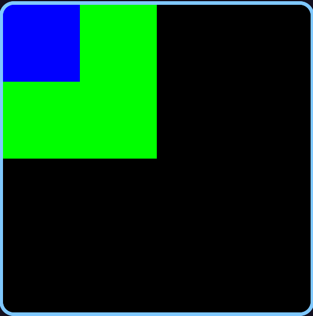

# Little C Project -- Falling Sand

So it turns out I can't work all day and all night on a single project without burning out on it. And yes, I know I said last post that I would get it out by the end of 2025, but that didn't end up happening. Don't worry, I'm still working on memory allocation and hyper-optimizing my bitmap algorithms, but I think I need some instant gratification to provide a break in my routine.

Advent of Code is an option. I did say I was going to do that this year but I completely forgot. And furthermore, I want to work on something a little more original.

Let's do some graphics in C. I'm taking a graphics course next semester (although that's mainly C++ and Typescript). Maybe a small physics simulation or something. I like the idea of those falling pixel sandboxes, like [sandboxels](https://sandboxels.r74n.com/) or [Sugar, Sugar](https://www.coolmathgames.com/0-sugar-sugar). How hard could a falling sand simulation be?

Also, my intent with this project is to do as much old-fashioned, real, American programming as I can. While I don't shun the use of LLMs in my day-to-day work, I want to decrease my dependence on them or use them more as a Google-like source than a code generation tool.

## Getting Familiar with the Library

~I guess I'll start with graphics.h. This [powerpoint I found online](https://www.highapproach.com/wp-content/uploads/2025/04/Unit-11-Introduction-to-Graphics-in-C.pdf) gives a decent intro to it.~

Turns out graphics.h is not recommended for modern compilers, according to StackOverflow. [SDL](https://www.libsdl.org/) seems the way to go.

Screw CMAKE. It's just a script that generates a Makefile (in other words, for folks who don't understand how Makefiles work). Maybe I'm a bit biased but I enjoy remembering how Makefiles work again every time.

Anyways, I started by creating my basic Makefile-based project structure:

```
sandbox
├── build
├── Makefile
├── sandbox
└── src
    └── main.c
```

I'm going to try out a simple [hello world based on this tutorial](https://www.youtube.com/watch?v=S1Yhr5Dlq98&list=PLvv0ScY6vfd-RZSmGbLkZvkgec6lJ0BfX&index=12) to start out.

First problem: I'm on [Wayland](https://wiki.libsdl.org/SDL3/README-wayland). Wayland requires apps to present a buffer before the window actually becomes visible, so I need to make sure I'm displaying something before I can ever see my window. This "Hello World" for SDL is literally just displaying a window, but for me I need to draw something on there.

But it's still not working. I tried calling `SDL_ShowWindow` to no avail. Maybe it's because:
> Additionally, applications must have an event loop and processes messages on a regular basis, or the application can appear unresponsive to both the user and desktop compositor.

Even after adding an event loop and processing an ESC key, the window still doesn't pop up or focus or anything. Here's the code so far:

```
#include <stdio.h>
#include <SDL3/SDL.h>

int main(int argc, char **argv){
  if(!SDL_Init(SDL_INIT_VIDEO)){
    SDL_Log("Init Failure");
    return -1;
  }

  SDL_Window *window = SDL_CreateWindow("SDL3 Test", 512, 512, SDL_WINDOW_RESIZABLE | SDL_WINDOW_BORDERLESS);

  SDL_Renderer *renderer = SDL_CreateRenderer(window, NULL);

  // Create a rectangle to render
  SDL_FRect rect = {.x = 0, .y = 0, .w = 512, .h = 512};
  SDL_SetRenderDrawColor(renderer, 0, 0, 255, SDL_ALPHA_OPAQUE);

  if(!SDL_RenderFillRect(renderer, &rect)){
    SDL_Log("Rect Render Failure");
    return -1;
  }

  if(!SDL_ShowWindow(window)){
    SDL_Log("Show Window Failure");
    return -1;
  }

  bool done = false;

  SDL_Event e;
  while (!done){
    while(SDL_PollEvent(&e)){
      if (e.type == SDL_EVENT_KEY_DOWN && e.key.key == SDLK_ESCAPE) {
        done = true;
      }
    }
  }

  SDL_DestroyRenderer(renderer);
  SDL_DestroyWindow(window);
  SDL_Quit();

  return 0;
}
```

Running in GDB tells me that a bunch of threads get initialized when my window is created, meaning it's not a linker issue; my library is getting linked in and running properly with just the -lSDL3 flag.

-----

Okay, finally got it working. Seems I needed to call `SDL_RenderClear` and `SDL_RenderPresent` every time we looped. Success!



Interesting that even though I created the blue rectangle with a size of 512x512, it scales when my window manager Niri decides to make the window size half of my screen size. When I resize the window, it seems to resize the rectangle with it. I wonder what the scaling mode is.

-----

Looks like Wayland doesn't really enjoy drawing my rectangles the size I make them. After I poked around a bit, I found it wasn't a Wayland issue but a issue with my understanding of `RenderClear`. `RenderClear` will use the last set `RenderColor` and fill the screen with it. And by setting the render color of the last rectangle and calling `RenderClear` _immediately_ before `RenderPresent`, I was unintentionally clearing all of my rectangles. With a bit of refactoring, I have a properly presenting window:

```
  SDL_Event e;
  while (!done){
    while(SDL_PollEvent(&e)){
      if (e.type == SDL_EVENT_KEY_DOWN && 
          e.key.key == SDLK_ESCAPE) {
        done = true;
      } else if (e.type == SDL_EVENT_QUIT) {
        done = true;
      }
      printf("%d\n\r", e.type);
    }

    SDL_SetWindowSize(window, 512, 512);

    SDL_SetRenderDrawColor(renderer, 0, 0, 0, SDL_ALPHA_OPAQUE);
    SDL_RenderClear(renderer);

    // Create a rectangle to render
    SDL_FRect rect = {.x = 0, .y = 0, .w = 256, .h = 256};
    SDL_SetRenderDrawColor(renderer, 0, 255, 0, SDL_ALPHA_OPAQUE);
    if(!SDL_RenderFillRect(renderer, &rect)){
      SDL_Log("Rect Render Failure");
      return -1;
    }

    // Another one!
    SDL_FRect rect2 = {.x = 0, .y = 0, .w = 128, .h = 128};
    SDL_SetRenderDrawColor(renderer, 0, 0, 255, SDL_ALPHA_OPAQUE);
    if(!SDL_RenderFillRect(renderer, &rect2)){
      SDL_Log("Rect2 Render Failure");
      return -1;
    }

    SDL_RenderPresent(renderer);
  }
```



I added this HANDLE_SDL_CALL macro to simplify my error handling:

`#define HANDLE_SDL_CALL(x) do {if(!x) {SDL_Log("Failed " #x " on line %d", __LINE__); return -1;}} while(0)`

It will print the line that failed as well as its line number, so I know exactly where to find the error.

## The First Grain of Sand

After just a little more work choosing a sand color, making it the right size and start in the center-top of the screen, we have a falling sand pixel.

[one falling pixel](one-falling-pixel.mp4)

Now, the speed of the sand and the frame rate are tied together, which isn't a great thing. Our exit detection is also tied to the frame rate, meaning if my per-frame delay is set to something like 200ms, I have to wait at most 200ms for my input to take effect. If I make the sand slower, this will increase the input lag.

Thus, I've decided to use SDL's threads to separate out the physics logic from the frame display.

First, I separated out the logic for updating the state into `update_state`, and wrote out a little pseudorandom number generator using something called a [Linear Congruential Generator](https://en.wikipedia.org/wiki/Linear_congruential_generator). [This Low Level video](https://www.youtube.com/watch?v=wDj64pSeQ4I) introduced me to the concept.

```
// PSEUDORANDOM
#define P 2147483647
#define A 16807
int pmcurr = 0;

// Based on https://statmath.wu.ac.at/software/src/prng-3.0.2/doc/prng.html/Table_LCG.html
// Recommended parameters by Park and Miller (pm)
int pmrand(){
  pmcurr = (pmcurr*A) % P;
  return pmcurr;
}
// PSEUDORANDOM
```

The reason I need a RNG is to determine the direction the grain of sand floats in every step. Every tick, the grain of sand will float left one pixel, right one pixel, or stay put on the x-axis. Sugar, Sugar uses this logic (I saw it in a video but unfortunately have lost track of it). It's an easy and cool way to simulate wind blowing the sand all over the place.

```
void update_grain(SDL_FRect *grain){
  grain->y += grain->h;
  grain->x += pmrand() % 3 - 1;
}
```

Now, I just call this method in `update_state` and render in the main loop. I also didn't forget to _seed_ the random number generator with the current time in ns, a semi-random value. Our falling grain now looks like so:

[flaky sand](flaky-sand.mp4)

Pretty good! All that's left is to separate the grain logic and the render logic into two different threads. 

I realized that I'm able to make it a bit smoother with a few different tricks. I changed the y-increment from the height of the "pixel" (not really a pixel but a 5x5 block of pixels so it's actually visible) to 1, and divided the update speed by 5 (the height of the pixel). This way, it moves at the same speed but is able to move in sub-grain increments. I also sped it up a bit, so that it updates every 20ms.

```
#define GRAIN_SPEED 20 //ms

void update_grain(SDL_FRect *grain){
  grain->y += 1;
  grain->x += abs(pmrand()) % 3 - 1;
}

SDL_FRect grain = {256, 0, 5, 5};
int update_state(void *data){
  while (!done){
    update_grain(&grain);
    SDL_Delay(GRAIN_SPEED);
  }
  return 0;
}

int main(int argc, char **argv){
  // Seed random number generator
  struct timespec tp;
  clock_gettime(CLOCK_MONOTONIC_RAW, &tp);
  pmcurr = tp.tv_nsec;

  HANDLE_SDL_CALL(SDL_Init(SDL_INIT_VIDEO));

  window = SDL_CreateWindow("SDL3 Test", 512, 512, SDL_WINDOW_BORDERLESS);
  renderer = SDL_CreateRenderer(window, NULL);

  HANDLE_SDL_CALL(SDL_SetWindowSize(window, 512, 512));

  SDL_Thread *state_thread = SDL_CreateThread(update_state, "update state", NULL);
  SDL_Event e;

  while (!done){
    while(SDL_PollEvent(&e)){
      if (e.type == SDL_EVENT_KEY_DOWN && 
          e.key.key == SDLK_ESCAPE) {
        done = true;
      } else if (e.type == SDL_EVENT_QUIT) {
        done = true;
      }
    }

    HANDLE_SDL_CALL(SDL_SetRenderDrawColor(renderer, 0, 0, 0, SDL_ALPHA_OPAQUE));
    HANDLE_SDL_CALL(SDL_RenderClear(renderer));

    HANDLE_SDL_CALL(SDL_SetRenderDrawColor(renderer, 247, 209, 163, SDL_ALPHA_OPAQUE));
    HANDLE_SDL_CALL(SDL_RenderFillRect(renderer, &grain));

    HANDLE_SDL_CALL(SDL_RenderPresent(renderer));
  }

  SDL_WaitThread(state_thread, NULL);

  SDL_DestroyRenderer(renderer);
  SDL_DestroyWindow(window);

  SDL_Quit();

  return 0;
}
```

[smooth fall](smooth-fall.mp4)

## Multiple Grains

Next, we need to add multiple grains of sand. Every grain needs to be updated in the same update_state method. If I want to allow for an unlimited number of grains, I need to make sure to allocate enough memory for 512/h x 512/h grains, i.e. if the whole screen was filled with grains.

I start by `calloc`ing and initializing the whole array of grains, and maintaining a spawn pointer to track how many grains have been spawned so far. My `update_state` just loops through and updates all grains from 0 -> `spawn_ptr`. It also increments the `spawn_ptr` by 1 every iteration.

The main screen update thread does the same thing but renders all grains from 0 -> `spawn_ptr`. Oh yeah, there's also a mutex around the accesses to the grains array to ensure that there's no weird multithreading shit going on.

Here's the result.

[multiple grains](multiple-grains.mp4)

Later introduced a per-grain mutex in the grain structure itself, so that the renderer isn't blocked on the state update if it's rendering completely separate grains. You might call this a more "granular" mutex.

## Bottom Border

To start with piling up pixels we need to introduce a border on the bottom that the grains will hit. This is pretty simply done with one comparison in `update_grain`:

```
  if(grain->pixel.y < 512) grain->pixel.y += 1;
```

## Collisions

Now comes the harder part. The plan is to check if there's a grain to the immediate left or right of the pixel, and if there is, move in the opposite direction.

The immediate question is whether to do this update based on the screen state or the grain state. The screen currently updates way faster than the grains, so it could be held as pretty much constant during any given iteration of grain update. But in theory, we should be comparing the game state.

Having only one set of grains to update makes this strategy flawed. I need to keep track of the previous grain position to accurately compare the state in a single snapshot. Otherwise, what can happen is something like this:
1) Grain A and Grain B are adjacent. Grain A updates first, deciding to move to the left.
2) Grain B updates, but since Grain A has already moved, it sees no need to move to the right and continues.

But what _should_ happen is both grains should bounce off each other, moving in opposite directions. This is why a "previous gamestate" is necessary, or previous grain position.

Another strategy I could use is a vector for the velocity of the grain. If the current x position + the velocity vector (-1, 0, 1) is going to collide with another grain, we move it the opposite direction.

The problem I've noticed with doing it based on the game state is that there is not a great way to do collision logic without it being O(N^2) time. For every grain, I'd need to check every other grain to see if the position is a collision or not. So I guess I'm just going to have to extract the pixel values from the bitmap of the display.

-----

Ok, so it turns out that there's not a _great_ way to do this without making the renderer incredibly slow. I've looked through libSDL, and the closest thing I found was getting a pixel from a surface which you can get from a window. But it's specifically warned against in the documentation:

> This function prioritizes correctness over speed: it is suitable for unit tests, but is not intended for use in a game engine.

So we'll have to rawdog it. We can save the values of all the pixels in a large bitmap stored in row-major order. Since each grain of sand is 5x5 right now, each bit in the bitmap will represent one grain of sand, approximating the grid of 512x512 pixels to effectively 102x102. Even though grains of sand can have "micromovements" we can basically shift each grain to fit into this grid of 102x102 for the quick calculation.

Luckily, I've already implemented a semi-working bitmap for the OS project, so I can just symlink it here.

My first attempt at collisions is botched. The way it works is this:
- Calculate an `aligned_grain_ind` by dividing the x and y coordinates by `GRAIN_H`, then finding the bitmap position (since it's stored in row-major order).
- If that position is not currently filled in the bitmap, we "claim" it and do our old-fashioned random micromovement.
- If that position is currently filled in the bitmap, that means a different grain has already claimed the position. We pick a random between [-1, 1] and shift by `GRAIN_H` in that direction (trying to get rid of the collision), recalculate the new position in the bitmap, and then keep shifting until we don't collide anymore.

```
void update_grain(grain *grain){
  if(grain->pixel.y < GRID_SIZE-1) grain->pixel.y += 1;

  // Check surrounding pixels on screen state
  int aligned_grain_ind = coords_to_grain_ind(grain);
  int rand_dir;
  
  if(!bitmap_get(&grain_bitmap, aligned_grain_ind)){
    // Claim the position if not taken
    bitmap_set(&grain_bitmap, aligned_grain_ind, true);

    rand_dir = abs(pmrand()) % 3 - 1;
    grain->pixel.x += rand_dir;
  } else {
    // If taken, we need to shift until we're in a different spot
    rand_dir = ((abs(pmrand()) % 2) * 2) - 1;
    while(bitmap_get(&grain_bitmap, aligned_grain_ind)){
      grain->pixel.x += rand_dir * GRAIN_H;
      aligned_grain_ind = coords_to_grain_ind(grain);
    }
  }
}
```
And here's the result:

[migrating pixels](migrating-pixels.mp4)

sob emoji. 

Maybe dealing with mid-air collisions is not worth it. Instead, I could start on piling up grains of sand, and build from there.

To pile up grains of sand, my strategy is to keep an array of column heights, and place each grain into a specific column. Much like the original collision detection, we first approximate each grain of sand to a column that's divisible by `GRAIN_H` (i.e. chunking the 512x512 space into columns of width 5 each).

For the comparison to see if we keep incrementing the position, we first check if we've hit the current column's height (`grain->pixel.x / GRAIN_H` is the column number and `col_heights[column]` is the height). If we have, we do not change x or y, keeping it's position. Otherwise, we keep falling and going in a random left or right direction.

I also had to add an update parameter to the grain structure, so that we only call `update_grain` on grains we know haven't already been locked to their location. Otherwise, the column height would continually increase.

Here's the updated `update_grain` code.

```
void update_grain(grain *grain){
  // Check surrounding pixels on screen state
  int rand_dir = abs(pmrand()) % 3 - 1;
  int column = grain->pixel.x / 5;

  if(grain->pixel.y < GRID_SIZE - col_heights[column] - 1) {
    grain->pixel.x += rand_dir; 
    grain->pixel.y += 1;
  } else {
    col_heights[column]++;
    grain->update = false;
  }
}
```

And here's it in action:

[molehill](molehill.mp4)

Two things seem to happen while the simulation runs:
1. My laptop gets hot.
2. Sand grains don't ever fall, and the tallest column is usually in the middle. Where's the natural sand dune of it all? This seems more like skyscrapers.

An issue with this approach is that there's nothing stopping a sand grain from just shifting into a column that's already higher than it. Then, it will increment the column height and stay put, further increasing the likelihood that another sand grain will shift into the same column.

To remedy this, a sand grain needs to stop before shifting into a taller column than it. Thus, when a `rand_dir` is decided, we need to check the new column to see whether it's a viable movement option.

```
  if(grain->pixel.y < GRID_SIZE - col_heights[column] - 1) {
    int new_column = (grain->pixel.x + rand_dir) / 5;
    if (grain->pixel.y + 1 < GRID_SIZE - col_heights[new_column] - 1){
      grain->pixel.x += rand_dir; 
    }
    grain->pixel.y += 1;
  } else {
    col_heights[column]++;
    grain->update = false;
  }
```

[dune](dune.mp4)

[my dune](https://external-content.duckduckgo.com/iu/?u=https%3A%2F%2Fi.imgflip.com%2F8wgcy0.gif&f=1&nofb=1&ipt=806b32d7fd4db426bbddb40b6f3699a8186d36e690a216c40e76fde90c6da402)
## Performance

Let's tick off the "laptop gets hot" box. Adding a frame counter and a debug thread should allow us to see the FPS live on the sandbox. We need the debug thread to delay every, let's say 500ms, and wait for the frame counter to accumulate. Then we just divide the number of counted frames by the delay time, and boom! We have FPS.

```
SDL_Mutex *frame_counter_mtx;
int frame_counter = 0;
float fps = 0;

int update_debug(void *data){
  while (!done){
    SDL_Delay(500);
    fps = frame_counter / 0.5;

    SDL_LockMutex(frame_counter_mtx);
    frame_counter = 0;
    SDL_UnlockMutex(frame_counter_mtx);
  }

  return 0;
}
```

[fps uncapped](fps-uncapped.mp4)

That's a pretty high number of FPS. The amount the game updates is completely uncapped right now! This means my process is just eating up CPU, which is probably what's leading to the increased heat.

To cap it, we can just determine how much time was taken up by the rendering by measuring ticks before and after the rendering process, then subtracting that from 17. Why 17? That's the amount of time one frame should take at 60 FPS but rounded to the nearest integer.

So again, we measure time A at the beginning of our loop, time B at the end of our loop, and subtract the difference from 17. It looks something like this:

```
  while (!done){
    uint64_t time_a = SDL_GetTicks();
    ...
    loop contents
    ...
    uint64_t time_b = SDL_GetTicks();
    SDL_Delay(17 - (time_b - time_a)); // cap to 60fps
  }
```
And there you have it. Now my computer is perfectly fine and our FPS counter shows 60-ish.

[fps capped](fps-capped.mp4)


### TODO:
- Use FillRects by separating the rects array out
- "Chunk" mutexes
