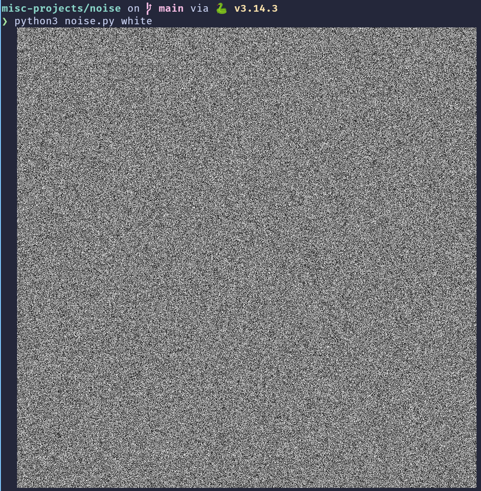
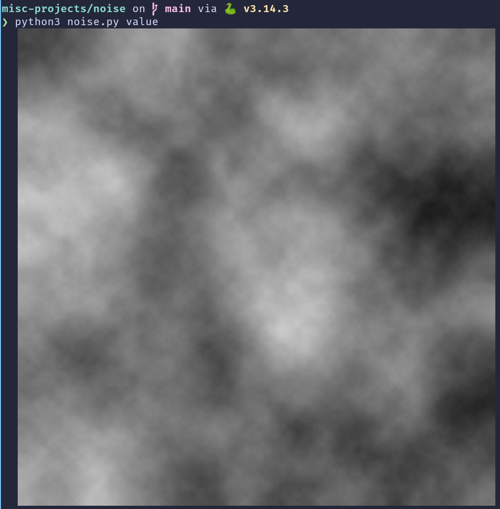
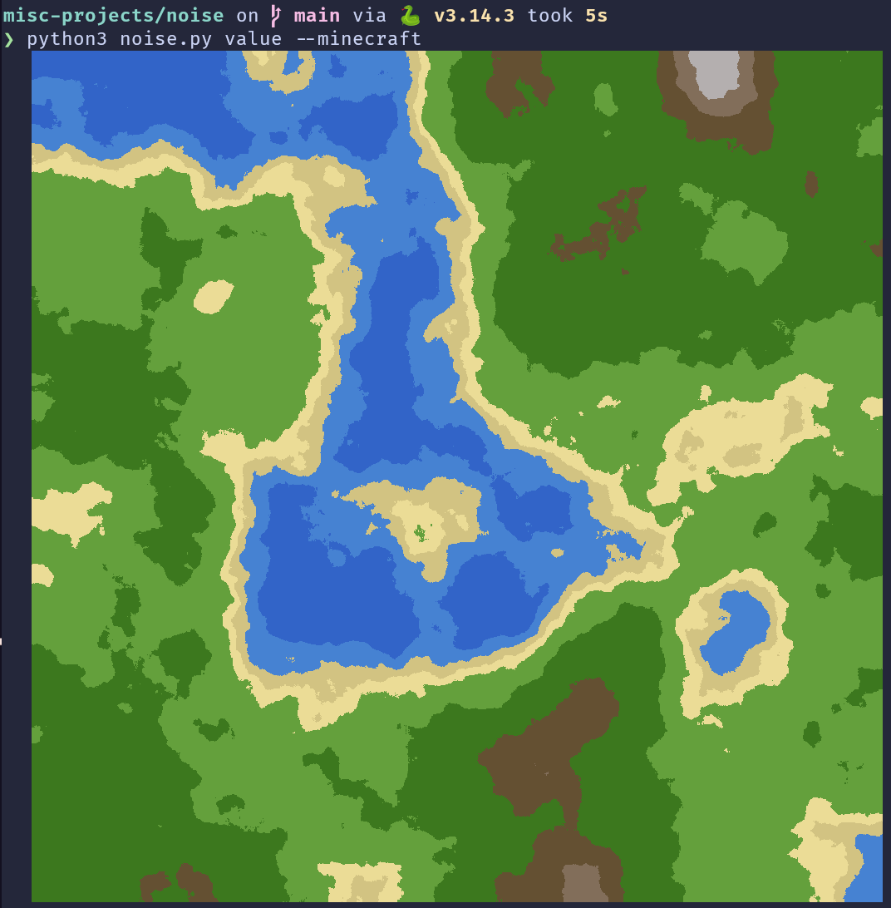
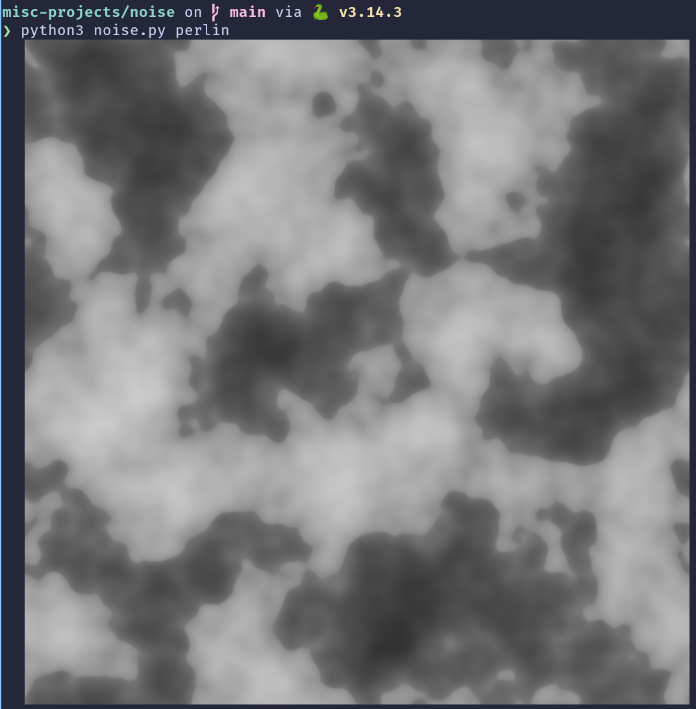
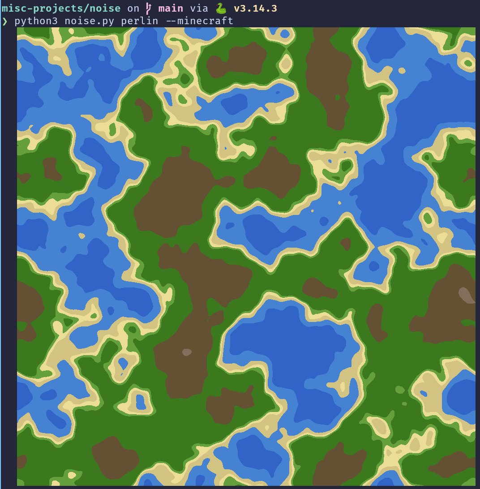

<!--04-04-2026-->
<!--PUBLISH-->

April 04, 2026

# Noise Generation
I wanted to experiment with noise-based world generation using white, value, and Perlin noise after I learned about them in my Graphics class. So I built a quick little script to generate Minecraft-style worlds with them. Here's some screenshots.

[Repo link](https://github.com/IshDeshpa/misc-projects)

## White Noise

## Value Noise

## Perlin Noise

Anyways, that's all for now.
