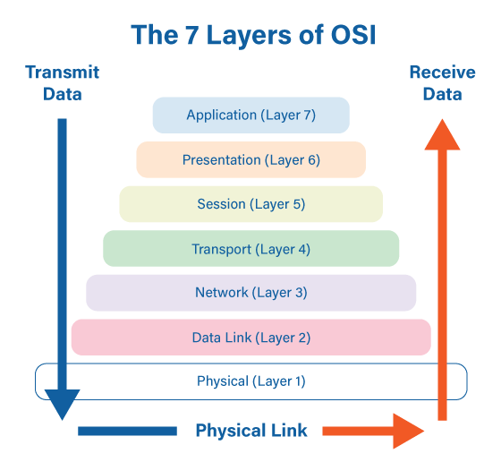
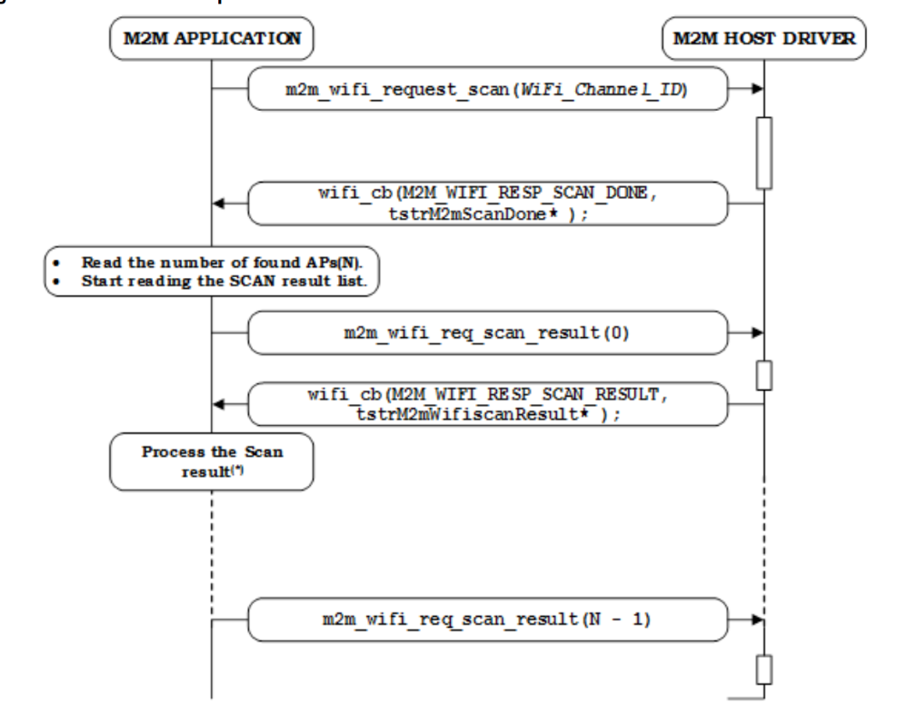
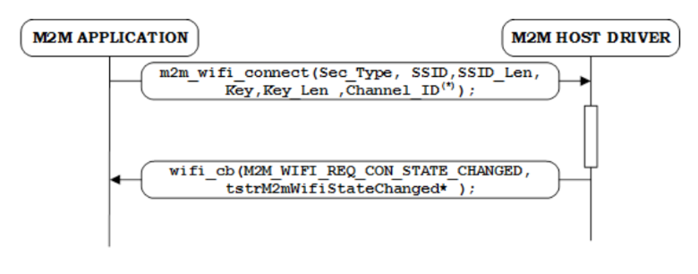
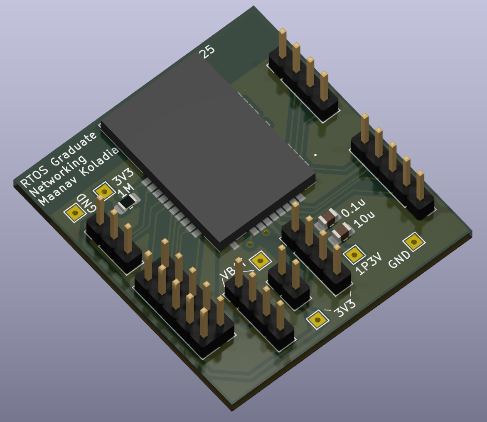
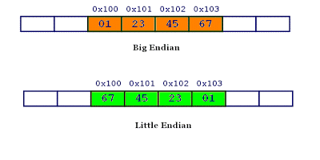
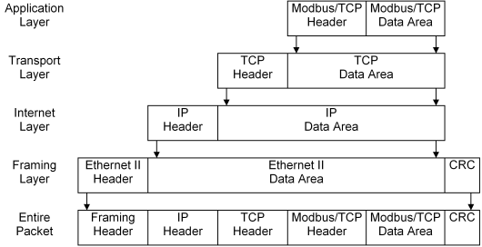
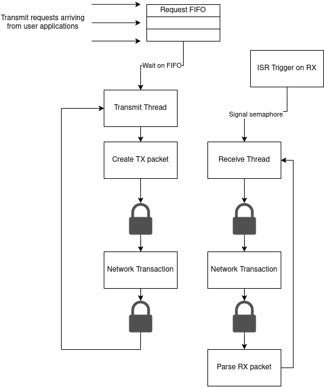

<!--05-07-2025-->
<!--PUBLISH-->
<!-----

You have some errors, warnings, or alerts. If you are using reckless mode, turn it off to see useful information and inline alerts.
* ERRORs: 0
* WARNINGs: 0
* ALERTS: 7

Conversion time: 1.477 seconds.

Using this Markdown file:

1. Paste this output into your source file.
2. See the notes and action items below regarding this conversion run.
3. Check the rendered output (headings, lists, code blocks, tables) for proper
   formatting and use a linkchecker before you publish this page.

Conversion notes:

* Docs to Markdown version 1.0β44
* Tue May 06 2025 22:34:20 GMT-0700 (PDT)
* Source doc: ECE380L.12 Project Report
* This document has images: check for >>>>>  gd2md-html alert:  inline image link in generated source and store images to your server. NOTE: Images in exported zip file from Google Docs may not appear in  the same order as they do in your doc. Please check the images!

----->
May 07, 2025
## Preface:

Maanav and I completed a basic functional wifi stack. Here's the project report if interested.

# ECE380L: Networking with an RTOS

## [Repository](https://github.com/IshDeshpa/445M_Networking)
## Maanav Koladia & Ishan Deshpande
## Spring 2025

**Project Introduction**

Our project aims to develop a partial network stack for the TM4C RTOS, enabling WiFi communication. This will enhance the RTOS’s functionality in various applications. The objectives include developing a network stack for TM4C RTOS, integrating the ATWILC1000 WiFi module with the TM4C123GH6PM microcontroller, ensuring reliable WiFi communication, optimizing for varying latency, and offloading tasks to a secondary TM4C microcontroller if needed. The methodology involves setting up the TM4C123GH6PM and ATWILC1000 module, developing or adapting a network stack, integrating the stack with the RTOS and testing, optimizing performance, and documenting the process and preparing a final report. The expected outcome is a functional network stack integrated with TM4C RTOS, enabling reliable WiFi communication for applications like IoT and remote monitoring. The required resources include TM4C123GH6PM microcontrollers, ATWILC1000 WiFi modules, and development tools and Software. This project will enhance our understanding of network protocols and embedded systems, contributing to a versatile and powerful RTOS. By achieving these objectives, we aim to provide a robust solution for WiFi communication in embedded systems, which can be utilized in various applications, thereby broadening the scope and capabilities of the TM4C RTOS.

**Design and Implementation**

**Hardware**

Using the ATWILC1000 module was a challenge primarily due to our lack of understanding of the module. First, we had to create a breakout board for it in KiCAD (shown below). The breakout simply consists of headers that expose the chip’s pads as well as a configuration resistor to set it to SPI mode. Soldering the board was a little difficult since it was a castellated PCB upon SMD pads, but we got it done (with the other chip as a casualty of the process).

**Chip Functionality**

1. The chip acts as a bridge between Wifi and Ethernet. Thus, all interactions between the TM4C and the chip are done with the understanding that the chip will convert the ethernet frame to a wifi frame before sending it out.
2. The chip allows us to interface with it over SPI, SDIO, or I2C. We chose SPI because it seemed the simplest to implement, yet offered a good amount of speed. SPI messages to the chip are formatted as reads/writes to addresses or to registers of the chip’s memory.
3. The chip handles the data link and physical layers of the 7-layer OSI model (shown below). Thus, our job will be to implement the network and transport layers. \

**Initialization Ritual**

The ATWILC1000 is a chip that needs to be fully flashed as part of its initialization ritual. It does not have any non-volatile memory on board for its code so it does not persist when it loses power. Thankfully, we were able to find Linux drivers that handled a majority of the flashing process, only requiring us to stub in our lower level SPI and GPIO implementation to handle the power initialization and interchip communication. This is called the chip’s BSP, or board support package.

Getting this initialization process working was a pain. Just getting the chip to flash required us to inspect the SPI logs heavily, and make modifications to the source as we saw fit.

**Transmit Stack**

The driver divides packets received from the chip into two pools: ethernet and wifi. 

The wifi packets allow us to parse general information and execute commands such as “Scan for networks” or “Connect to wifi” so that we can actually command the chip. By reading through the documentation for the WILC, we were able to write basic scanning and connection code.

The ethernet packets, on the other hand, are the raw data sent to/from some access point or other device on the network.

Our initial idea was to get a proof-of-concept “ping” running between our laptop and the TM4C. Ping will just respond to echo requests coming from another device on the network. In order to implement ping, we needed to implement:

* ICMP, which requires
* IP, which requires
* MAC

However, a realization that was later made was that in order to even have an IP address, we’d need to implement a DHCP client. DHCP allows us to lease an ip address from a DHCP server running somewhere else on the network, and it runs on UDP. Thus, the following were also necessary:

* DHCP
* UDP

Another problem that came up was that our laptop needs to be able to know both the IP and MAC of any device we interact with on the network (to insert into the IP and MAC layers).

Thus, we required ARP. ARP is an IP to MAC address caching mechanism that allows us to address a device with both IP and MAC. The laptop will send an ARP request upon connection to the network to all devices (a broadcast), and the TM4C will respond with its IP and MAC address to the laptop. If all goes successfully, the laptop will stop sending ARP packets since it now has the IP/MAC pair cached.

Since UDP was already necessary, we ended up implementing a basic netcat application that allowed us to send and receive to a laptop as well as ping.

**Asynchronous Receive**

The flow of asynchronous receive is as follows:

1. IRQ line pulled low, signaling that there is a receive pending
2. ISR gets triggered
3. ISR defers the processing to a foreground thread by signaling a semaphore and exits

This allows us to keep the ISR short and bounded, and schedule the processing work in the existing priority mechanism of the RTOS. The receive processing is done in a separate thread from the transmit processing; so that one receive can be processed concurrently while generating a transmit packet.

**Simulation with Wireshark**

We found that it was a much slower process to debug logical errors on hardware, so we opted to create a simulation with a set of Python/Bash scripts that simulated a TX or RX with our code running locally on our laptop. The simulation makes heavy use of *tshark*, the CLI interface for Wireshark which takes in a set of bytes in network order and prints out the correctly parsed packet information. We set up a Makefile that stubs out a layer of function calls called ethernetTX and ethernetRX. We set up a Makefile that stubs out a layer of function calls—ethernetTX and ethernetRX—which are invoked whenever a complete packet is ready to be sent or has just been received. These are the final function calls before interacting with the WILC network interface.

In the simulation version of the code, ethernetTX just writes the bytes of a full ethernet packet to a file, which are then read in by text2pcap to convert them into parseable network packets for tshark. This structure effectively allowed us to unit test each layer individually; we could see what tshark had failed to parse and then figure out why we were inserting the wrong data.

For ethernetRX, we had a set of functions that printed out each layer of the stack. This allowed us to compare our RX parsing with the parsing that wireshark had done and note the differences.

The simulation layer of our code allowed us to verify that random bytes were being sent properly; but we were also able to write code to test a four-way DHCP transaction (DISCOVER, OFFER, REQUEST, ACK) and iron out logical errors there. We could then just build for hardware and, with a little more debugging, get DHCP working in a day.

This brings us to the most common and frustrating bug in our stack:** endianness.**

**Endianness**

When sending bytes across the network, there must be a consistent order of bytes agreed upon by all devices on the network. This is typically big-endian order (or network order); where each field larger than a byte needs to have the bytes flipped. 

Most of our issues were endianness issues. We dealt with flipped IP addresses, flipped MAC addresses, and more. Apparently sometimes two different fields are combined into one field that needs to be flipped into little endian order. And all of this is important for calculating the checksum and using the field properly!

The hton and ntoh functions (host-to-network and network-to-host) allowed us to do these flips, but we needed to make sure we were flipping the right fields since there were some inconsistencies. For example, one bug was that the IHL and the IP Version fields needed to be flipped with each other, even though each field is 4 bits (all fits within one byte).The devil is in the details!

**Conclusion**

In this project, we built a basic network stack for the TM4C RTOS and added WiFi support using the ATWILC1000 module. This allowed the TM4C123GH6PM microcontroller to connect to a network and communicate wirelessly. We faced several challenges, from designing and soldering a custom breakout board to getting the chip to work over SPI and writing the required network protocols like ARP, DHCP, UDP, and ICMP. To make debugging easier, we created a simulation setup on our laptop using Wireshark, which helped us test and fix issues before running the code on hardware. One of the biggest issues we faced was handling endianness, where we had to make sure the order of bytes sent over the network matched what other devices expected. In the end, we were able to send and receive packets, connect to WiFi, and even implement a basic ping and netcat setup. This project helped us learn a lot about networking, embedded systems, and problem-solving, and it added important new features to the TM4C RTOS.

Future work includes possibly implementing TCP on top of our stack, perhaps using P2P or AP mode on the WILC, adding IPV6 support, or adding basic security features. Perhaps a future graduate student could work on these using our repository!

**References**

    [1] “Packetor - Online Network Packet Analyzer / Decoder.” *Packetor.com*, packetor.com/.

    [2] “The TCP/IP Guide - DHCP Message Format.” *Tcpipguide.com*, 2025, www.tcpipguide.com/free/t_DHCPMessageFormat.htm.

    [3] Wireshark Foundation. “Wireshark.” *Wireshark.org*, 2024, www.wireshark.org/.

    [4] IshDeshpa and maanavkoladia. “GitHub - IshDeshpa/445M_Networking: RTOS Networking Project for UT ECE 445M.” *GitHub*, 2025, github.com/IshDeshpa/445M_Networking. Accessed 29 Apr. 2025.

