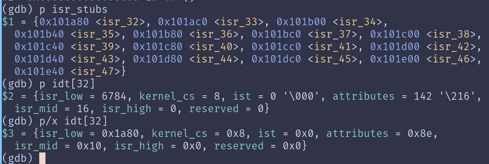
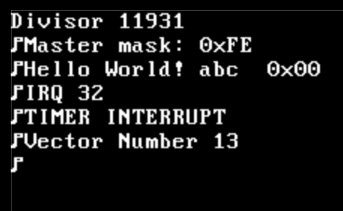
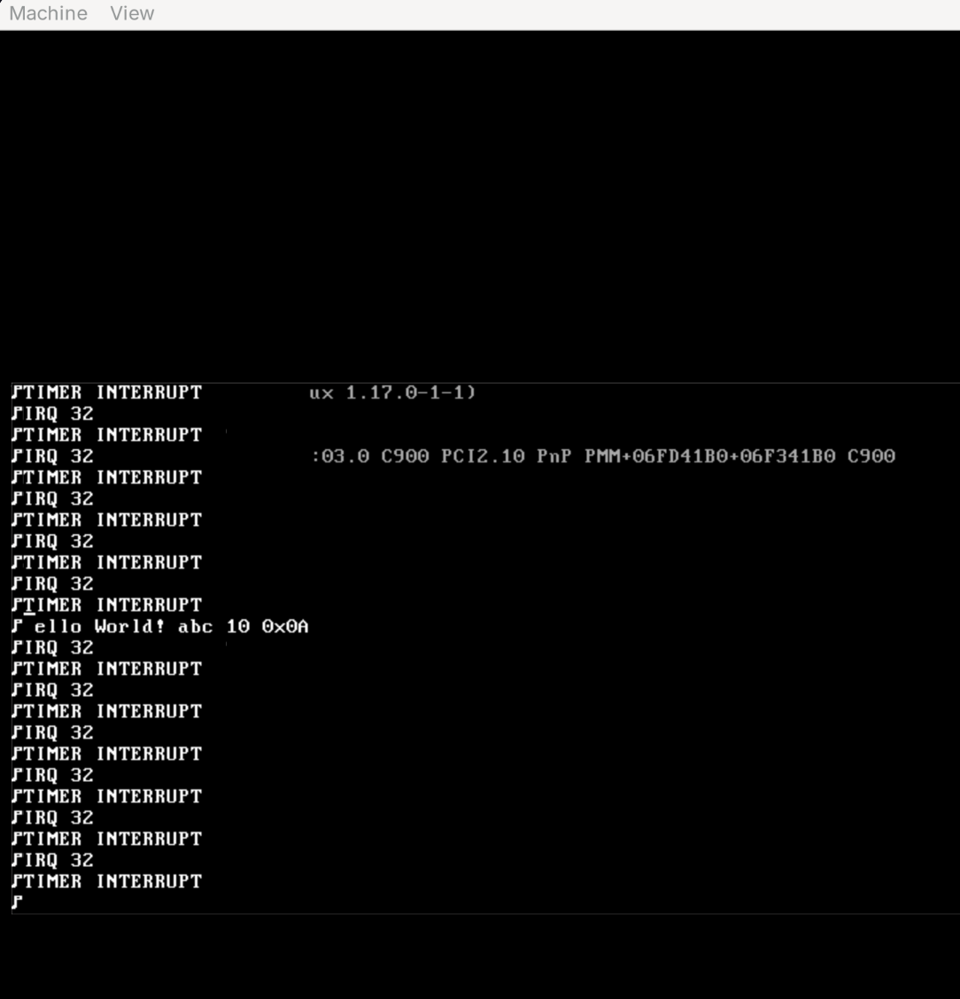
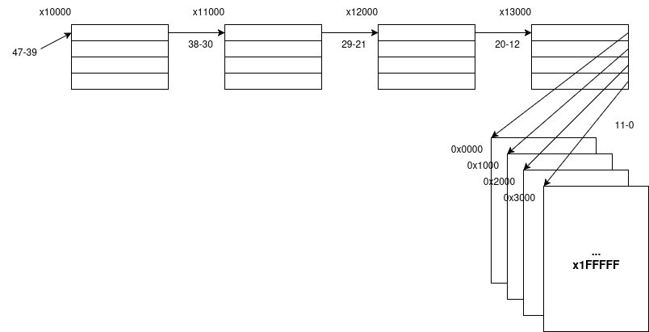
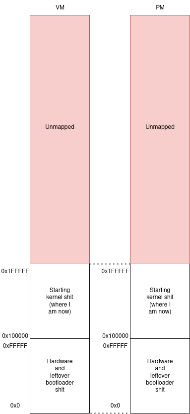
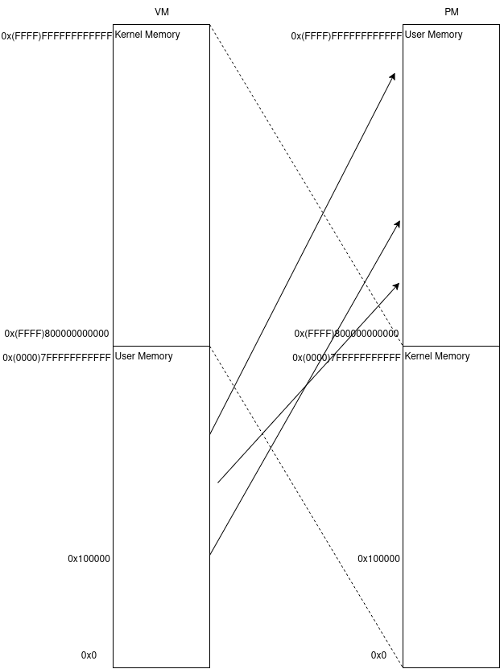
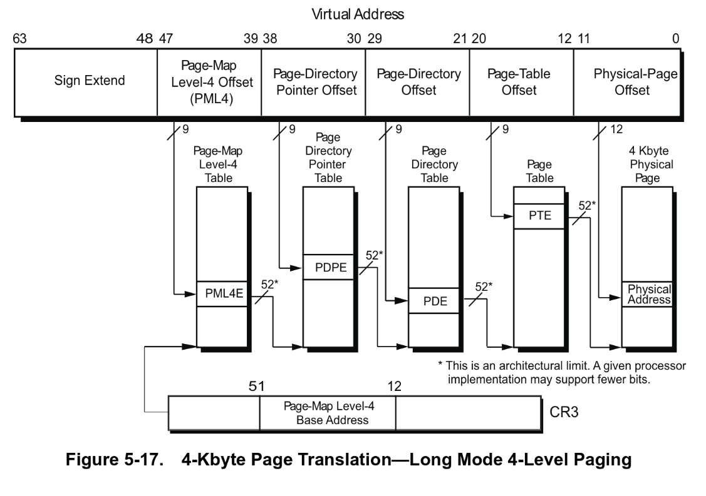
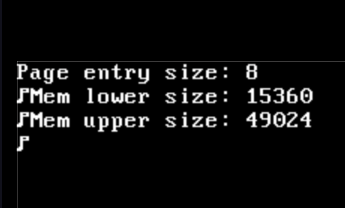
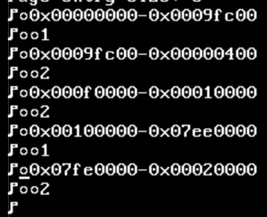

<!--PUBLISH-->

November 2, 2025 (but a work in progress since the last post on September 29, 2025)

# Waddle OS -- Beginnings

Now we're getting to the meat and potatoes of this project. Or maybe not.

Even after setting up a basic bootloader and booting into the kernel, there's still a lot of stuff we have to do. In a vague ordering:

- Set up the GDT (again)
- Set up the IDT for interrupts
- Set up printf for debugging purposes
- Figure out which timer interrupt to use for scheduling
- Set up paging (again), but this time instead of identity mapping I need to do a higher-half kernel.
- Write the scheduler

and since I took it upon myself to write my own bootloader, if the bootloader breaks at any point I'm going to have to go fix it.

## The GDT (again)
This was pretty easy. I copied the 64-bit GDT code entry and the GDT data entry from my bootloader and pasted it into my `startup.S`. The reason I need to redo the GDT and paging is because the bootloader is only temporarily loaded into memory. As soon as we enable the page replacement algorithm, the bootloader could in theory be overwritten since we no longer need it resident in memory.

## The IDT
Interrupt descriptor table contains the function pointers for all of the interrupt/exception handlers along with some other metadata about each vector. It's like the interrupt vector table I'm used to in embedded systems.

Now that we're working in C land, I'm able to represent IDT entries as structs and write an `idt_set_descriptor` method that sets up a vector number with an isr.

```
void idt_set_descriptor(uint8_t vector, void *isr, uint8_t flags){
  idt_entry_t *descriptor = &idt[vector];

  descriptor->isr_low = (uint64_t)isr & 0xFFFF;
  descriptor->isr_mid = ((uint64_t)isr >> 16) & 0xFFFF;
  descriptor->isr_high = ((uint64_t)isr >> 32) & 0xFFFFFFFF;
  descriptor->ist = 0;
  descriptor->kernel_cs = 0x08; // my 64 bit selector
  descriptor->attributes = flags;
  descriptor->reserved = 0;
}
```

A lot of this was taken from either ChatGPT or the [Interrupts Tutorial](https://wiki.osdev.org/Interrupts_Tutorial), btw.

The `idt_init` method allows me to call idt_set_descriptor for every vector from 0-31:
```
void idt_init(){
  idtr.base = (uint64_t) &idt[0];
  idtr.limit = sizeof(idt_entry_t) * IDT_MAX_DESCRIPTORS - 1;

  uint8_t flags = 0x8E; // interrupt gate, present, ring 0

  for(uint8_t vector=0; vector < 32; vector++){
    idt_set_descriptor(vector, isr_stubs[vector], flags);
  }

  __asm__ volatile("lidt %0" : : "m"(idtr));
}
```

## Do I Implement Printf?

Now the question is... do I implement printf.

I said I was going to implement everything, including the standard libraries required to build my OS. But then again... it's printf. It's like mega annoying and not in an educational way.

## Implementing Printf

We're starting with something similar to [this](https://www.geeksforgeeks.org/c/how-to-write-your-own-printf-in-c/). I've never worked with variable args in C so this could be considered a learning moment.

```
int printf(const char *str, ...){
  va_list ptr;
  va_start(ptr, str);
  
  for(int i=0; str[i] != '\0' && i < MAX_PRINTF_LEN; i++){
    if(str[i] == '%'){
      switch (str[i+1]) {
        case 's':
          term_print(va_arg(ptr, char*));
          break;
        case 'd':
          int a = va_arg(ptr, int);
          char buf[20];
          uint8_t i=0;

          while(a){
            buf[i++] = a%10;
            a/=10;
          }

          while(i > 0){
            term_putc(buf[--i] + '0');
          }

          break;
        case 'x':
          term_print("0x");
          term_putbyte(va_arg(ptr, int));
          break;
        default:
          term_putc('X');
          break;
      }

      i++;
    } else {
      term_putc(str[i]);
    }
  }

  va_end(ptr);
  return 0;
}
```

I know this is an extremely, extremely basic printf implementation but I am lazy and want something that works quick fast.

I realized during this that my VGA terminal driver I wrote while working on my bootloader only has 80 columns of output, so some of my test messages were getting cut off. To upgrade this, I have to add another item to the to-do list:

- Implement better graphics. This requires like, actual pixel-by-pixel output and fonts and stuff, so I'm tabling this.

## [Timer Interrupts](https://wiki.osdev.org/Timer_Interrupt_Sources)

Timer interrupts will be the core of the OS. Zoning in on this line:

> A good OS would detect which timers exist and determine their capabilities; then use this information to select the best timers to use for each different purposes. 

I want to do that eventually. But first, let's implement at least one of them.

- RTC: Real time clock. Seems like it has a fixed-frequency IRQ up to 8kHz. Mainly used for time and date purposes.
- PIT: Programmable Interval Timer. I'll probably start with this for my OS timer interrupt since that's what PintOS uses.

In order to interact with hardware, we have to use inb/outb, which are x86 assembly instructions that output values to ports on I/O. I set up some handy macros for this:

```
#define inb(port) ({ \
    uint8_t _ret; \
    __asm__ volatile ("inb %1, %0" \
                      : "=a"(_ret) \
                      : "Nd"((uint16_t)(port))); \
    _ret; \
})
#define outb(val, port) __asm__ volatile ("outb %0, %1" : : "a"((uint8_t)val), "Nd"((uint16_t)port))
```

in a file called `io.h`.

This will let us set register values on I/O hardware. Next, we need to figure out how to write the timer interrupt handler itself.

A point of confusion for me is the IDT vs regular hardware IRQs. The IDT vectors 0-32 seem to be mostly exceptions or reserved. Where does this leave the hardware interrupts, such as the timer interrupt that PIT should trigger?

The PIC, or Programmable Interrupt Controller, is a piece of hardware that handles hardware interrupts. Early x86 had an actual piece of hardware for the PIC (8259 PIC), but later x86 systems have an emulated PIC for legacy reasons and an APIC (Advanced PIC) for per-CPU interrupts. Since I'm only writing a single core OS for now, I just need to enable the legacy PIC emulation that's probably built into qemu.

[8259_PIC](https://wiki.osdev.org/8259_PIC)

I ended up copying a lot of this PIC driver for my purposes, with `pic_init`, `pic_eoi`, `pic_disable`, and `pic_enable`. It's interesting to see how interfacing with this is just like any other old embedded device, and I have the [datasheet](https://pdos.csail.mit.edu/6.828/2010/readings/hardware/8259A.pdf) pulled up and everything.

The PIC functions by driving an interrupt line high, letting the processor know that an unmasked interrupt has been triggered. The master PIC will then either send the interrupt vector or ask the slave to send the interrupt vector to the processor. Then, the processor looks up the vector number in the IDT and triggers the interrupt handler.

So the hardware IRQs are originally mapped from 0-7 (for master PIC) and 8-15 (for slave PIC) for the vector number, but need to be remapped past 32 because we have the exceptions in the IDT from earlier.

I set up a tiered driver structure where I have `pic.c` and `idt.c` handle the external and internal interrupts (respectively) and `interrupts.c` to tie it all together in a unified interface.

Next, I have to actually set up the timer peripheral which is connected to the PIC.

From [this page](http://www.osdever.net/bkerndev/Docs/pit.htm):
>  The Programmable Interval Timer (PIT, model 8253 or 8254), also called the System Clock, is a very useful chip for accurately generating interrupts at regular time intervals. The chip itself has 3 channels: Channel 0 is tied to is tied to IRQ0, to interrupt the CPU at predictable and regular times, Channel 1 is system specific, and Channel 2 is connected to the system speaker. As you can see, this single chip offers several very important services to the system. 

Interestingly enough, the default rate of Channel 0 is 18.222Hz in order for a 16-bit timer counter to wrap once every hour.

While trying to enable this, I realized I was double faulting as soon as I enabled interrupts. I also realized that I had never initialized the stack pointer (which could be overwriting some memory somewhere). So I initialized the stack pointer but was still having a hard time getting the error code (for a double fault it should always be 0, but the last thing on the stack was 0x32).

OSDev says the following:
> A Double Fault occurs when an exception is unhandled or when an exception occurs while the CPU is trying to call an exception handler. Normally, two exception at the same time are handled one after another, but in some cases that is not possible. For example, if a page fault occurs, but the exception handler is located in a not-present page, two page faults would occur and neither can be handled. A double fault would occur.
A double fault will always generate an error code with a value of zero.
The saved instruction pointer is undefined. A double fault cannot be recovered. The faulting process must be terminated.
In several starting hobby OSes, a double fault is also quite often a misdiagnosed IRQ0 in the cases where the PIC hasn't been reprogrammed yet.

This is sort of unhelpful. How do I know if it's because I just don't have something mapped in the IDT or if it's my IRQ0 not being remapped past 0x32?

Checking my IDT in GDB reveals that the IDT entry for 0 is mapped to address 0x00000000, which is definitely not my isr_stub. Interesting.

```
  for(uint8_t irq_num=32; irq_num<48; irq_num++){
    idt_set_descriptor(irq_num, isr_stubs[irq_num], flags);
  }
```

Found the bug. isr_stubs was being indexed by 32, when it should be indexed by 0 since the ISRs start at vector x32.

But the vector number is still being reported incorrectly:


My IDT looks right though.


Update: vector number was being reported incorrectly because it was trying to read from the stack. My exception_handler function signature was `void exception_handler(interrupt_frame_t interrupt_frame, uint64_t vector_number);`, so everything inside interrupt_frame_t was being considered another argument and that was too much to go in just registers. Since my interrupt stub passes the interrupt_frame_t pointer in register %rdi, my function signature should reflect that a *pointer* is being passed rather than the full struct.

But I'm still double faulting. Now my exception vector is just reporting properly.

Update: fed the code into ChatGPT after banging my head against the wall. It claims I have a few issues:

1) pic_disable() and pic_enable() are wrong: I was writing to the COMMAND ports instead of the DATA ports when trying to set my masks for the PIC. This was overwriting my intiialization.

2) off-by-one error in `pic_set_mask/pic_clear_mask`:
```
if (vector > 8){
    port = SLAVE_PIC_DATA;
    vector -= 8;
}
```

This means that vector 8's mask would never actually be cleared.

Update: according to QEMU's monitor, i'm not even remapping the PIC properly:

```
pic1: irr=00 imr=8e isr=00 hprio=0 irq_base=70 rr_sel=0 elcr=0c fnm=0
pic0: irr=13 imr=b8 isr=01 hprio=0 irq_base=08 rr_sel=0 elcr=00 fnm=0
```

You can see that irq_base is still 0x08 and 0x70, which are the defaults. Something in my init sequence is wrong.

Update: I FIGURED IT OUT. It was my freaking function signature!!! Spot the difference:

`static inline void outb(uint16_t port, uint8_t val);`

`static inline void outb(uint8_t val, uint16_t port);`

Yeah, I'm fucking dumb. I've been passing in the port first this whole time, when my function signature requested the value first. Goddamnit... I spent hours on this.

With a minimal amount of bug fixes after this, I brought a tear to mine own eye:



But we're not done yet. Actually returning from the interrupt is still being annoying. A return from `interrupt_handler` causes a general protection fault. My guess? Probably the return address not being pushed properly to the stack via the cdecl standard. I'm calling the generic `interrupt_handler` function from assembly, but I should be pushing the return address properly.

The `call` instruction *should* push the return address onto the stack, but maybe it's being bungled?

No. Stepping through with GDB revealed that it's the IRETQ instruction causing the General Protection Exception, which is the last thing before I exit the isr_stub.

[help!](https://theokwebb.github.io/posts/interrupt-handling-and-stack-switching/)
Let's examine the stack on entry into isr_stub:
```
(gdb) x/12x $rsp
0x10a158:	0x00100240	0x00000000	0x00000008	0x00000000
0x10a168:	0x00210246	0x00000000	0x0010a180	0x00000000
0x10a178:	0x00000020	0x00000000	0x0010a1a0	0x00000000
```

Rearranging, we have:
RIP -> 0x0000000000100240
CS -> 0x0000000000000008
RFLAGS -> 0x0000000000210246

So CS is 0x08, which by the GDT should be correct. RIP also points to an address in `interrupts_enable`, which sounds about right since the interrupt happened immediately.

```
(gdb) x/12x $rsp
0x10a158:	0x00100240	0x00000000	0x00000008	0x00000000
0x10a168:	0x00210246	0x00000000	0x0010a180	0x00000000
0x10a178:	0x00000020	0x00000000	0x0010a1a0	0x00000000
```

And there's no change at the `iretq` instruction. So why the GP fault?

Update: I figured it out again. Guess what. It was me FLIPPING THE OPERANDS OF THE SELECTOR REGISTER MOV INSTRUCTIONS. So my segment selectors were never getting set with the data GDT entry (side note: that also had the incorrect values since I had just copied it over from 32-bit mode).

My beautiful, beautiful timer interrupts are repeatedly triggering:


And I can start on scheduling. Or paging. I have to do one of them first.

## Paging
I've spent the last couple hours reading through the [paging sections of OSDev](https://wiki.osdev.org/Paging) and parts of the AMD64 manual. Here's a few diagrams I worked on to try to conceptualize what I need to do.

Current page tables:


Current mapping:


Mapping I want:


I'm hoping to be able to write the paging code in C with minimal assembly, so I'm making my entries packed bitfields. I'm hoping the compiler can still turn this into a 64-bit value. If not, I'm going to probably need to write some bitfield wrapper code where I can set up fields with macros or something.

Here's the current PML4 entry struct:

```\
typedef struct {
  uint8_t xd : 1; // execute disable
  uint16_t avl1: 10; // available to software
  uint64_t pdp_base : 39; // page-directory pointer base address
  uint8_t avl2: 3; // available to software
  uint8_t mbz: 3; // must be zero
  uint8_t acc: 1; // accessed
  uint8_t pcd: 1; // page-level cache disable
  uint8_t pwt: 1; // page-level writethrough
  uint8_t us: 1; // user/supervisor (both is 1, supervisor only is 0)
  uint8_t rw: 1; // read/write
  uint8_t present: 1; // present
} __attribute__((packed)) pml4e_t; // page-map level 4 entry
```

Luckily enough, this seemed to work when I printed `sizeof(pml4e_t)`:
`Page entry size: 8`

So I can now go ahead and set up all of the different kinds of entries. I'm doing this according to the AMD64 programmer's manual, where they have nice clean diagrams for the entry bitfields. 

It seems all the page directory entries are pretty much identical, except for the page table entries themselves. However, I'm still going to make separate structs to delineate the different levels just so I don't get confused.



Time to figure out the proper linear mapping for kernel space. I want my starting VM address to be 0xFFFF800000000000. The first 17 bits are either all 1 or all 0, because addresses have to be canonical.

Given 9 bits for the PML4 offset, that's 2^9 PML4 entries. If the first bit is 1 for kernel space, that's 2^8 entries (0b100000000 - 0b111111111). 

For now, I'll have to load in the initial PML4 table, but in theory this should be the table that I swap out per-process in CR3, so it'll be in the PCB.

A question that came up is how I'm tracking all of these structures. Which pages do I put them on? How do I decide where the tables go?

_I_ shouldn't have to. My page allocator will decide for me. The idea is I have a bitmap fixed at the start or end of kernel memory (and aligned to a page boundary) which tracks which pages are allocated and which aren't. Then, I can just get the next open page and use that for each structure.

But how many bits do I need? Well, just the higher-half kernel is composed of 0x800000000000 bytes. Divided by 0x1000, that's 0x800000000 pages. Each page requires a bit, meaning that I'll need 0x800000000/8 = 0x100000000 bytes to represent all pages in the higher-half kernel.

----------

Update: I've made a crucial mistake. I forgot physical memory was not practically infinite, like virtual memory. What I _really_ should be doing is first checking how much physical memory there is, then making my palloc table large enough to handle that. Which means I can't statically allocate my bitmap as an array, like I planned to do, since my OS doesn't know how much physical memory exists until it queries the hardware.

This requires a change to my bootloader. Remember how I said to forget about the multiboot2 stuff? Welp, I guess we need that here. This is the way the kernel requests information from the BIOS; it's embedded in the kernel image and returned by the bootloader at load time at some arbitrary address.

The multiboot header tags are appropriately labeled as struct multiboot_header_tag, which represents different information requests from the OS. The multiboot tags (struct multiboot_tag) are placed at some address and that address is returned in register EBX to the main kernel when it's loaded.

The multiboot2 header is located in the text segment of my ELF, which is in the first section I load in. 

- After loading the first section of the kernel, I can cast it to a multiboot2 header and verify the magic number and checksum. This is trivial.
- Then, I need to refactor a bunch of my bootloader assembly to allow me to do arbitrary actions on real mode entry. That is, many of the pieces of information that the kernel requests of the bootloader can only be obtained while in real mode, and right now the code is non-generically only able to load sectors from disk in real mode. I want a piece of code that allows me to pass a subroutine to execute on real mode entry and return some information from there.

Aargh. I hate everything.

----------

Ok, it's taken me like three weeks to do all of that. Most of it was spent stuck on why I wasn't able to properly enter real mode again (the answer was I forgot to jump to 16-bit protected mode first). But I've successfully refactored the majority of my bootloader assembly code so that I can now easily set up arbitrary real mode functions and execute them starting in protected mode.

Next, I set up a function in my bootloader called `get_basic_meminfo` which runs [BIOS Function: INT 0x15, AX = 0xE801](https://wiki.osdev.org/Detecting_Memory_(x86)#Detecting_Low_Memory) to get the amount of low memory (below 1MB) and high memory (above 1MB) that exists.

After doing a bunch of parsing and looping, I've got a structured bootloader that's easily extensible should I need to add more information requests. I also decided to save the return information at 0xC000 just because it exists above the upper bound of my disk buffer (0x8000 - 0xB000) but below the lower bound of my kernel (0x10000).

I was able to iterate through and find the basic_meminfo tag returned by the bootloader in my `paging_init` method. Printing this out, it reveals my lower memory (here, defined as 1M - 16M) and upper memory (16M to the next memory hole) sizes.



What's this? The default QEMU mem size is 128MiB but I'm really only getting 15+49 = 64ish here. So it's probably time to ditch just trying to get basic meminfo and implement in getting the full memory map.

----------

I'm really racing through tasks today. I was able to finalize the bootloader's get memory map functionality, and return it to the kernel. In paging_init I traverse the memory map and sort it, getting me a structure like so:



The format of this dump is as follows, for each entry:
```
baseaddr-size
  type
```

You can see that the final entry is a base of 0x7fe0000 and a size of 0x00020000, which adds up to a total RAM size of 0x80000000, or 128MiB exactly. Wonderful.

Next up on the list is to initialize my page allocator bitmap, which will require the existence of a bitmap driver. If I want a good bitmap driver I probably want to use malloc to allow arbitrary and dynamic size allocation, but I'm just going to make a mode that allows me to create a bitmap with a statically allocated buffer as well.

On to the bitmap driver we go! 

Another thing I wanted to note down that still needs to be added to the list is a serial driver. QEMU exposes its serial UART port directly to the host console, which means I can print there instead of VGA and probably have more space to display things as well.

----------

Update: I've implemented the serial driver and linked my printf implementation to it, so now I can choose to either output to VGA or to SERIAL_COM1. 

I also started on paging. I realized that my previous bitfield implementation wasn't exactly the most portable, so I switched to these GET_BITS and SET_BITS macros that do the shifting manually.
```
#define GET_BITS(value, pos, len) ((((uint64_t)(value)) >> (pos)) & ((1ULL << (len)) - 1))
#define SET_BITS(value, pos, len, newval) \
    ((((uint64_t)(value)) & ~(((1ULL << (len)) - 1) << (pos))) | \
    ((((uint64_t)(newval)) & ((1ULL << (len)) - 1)) << (pos)))
```

The next dilemma I'm currently solving is the paging problem. I thought that identity mapping in the bootloader would be the easiest solution, but this means that my kernel would have to be split into two stages: a identity map linked kernel that acts as a trampoline to the actual kernel which is mapped at higher half addresses.

This is ugly. I don't want to have to do _another_ trampoline! So my bootloader is now going to handle the higher half mapping for me, and I'm going to reset it to a page table in kernel memory when I enter the kernel.

These are the indices of my page table that the base of the higher-half kernel needs to exist at. Thus, I need to add mappings such that the identity map and these higher half page maps point to the same final page tables. I need to keep the identity mapping because my current bootloader code runs there.


----------

Ok, so paging has been successfully set up. Forgive me if I spare you the details, all the code is available on my GitHub at [https://github.com/IshDeshpa/WaddleOS](https://github.com/IshDeshpa/WaddleOS). 

The last few bugs were merely misunderstandings about whether virtual addresses or physical addresses go into the page table entries (it's physical).

If you're interested, my log output looks something like this:
```
Elf header obtained!
Linfo[0] = 0x0000000000100000

Tags Requested: 80
Entering kernel at 0xffffffff801037cf
	0x0000000000000000-0x000000000009fc00

		1

	0x000000000009fc00-0x0000000000000400

		2

	0x00000000000f0000-0x0000000000010000

		2

	0x0000000000100000-0x0000000007ee0000

		1

	0x0000000007fe0000-0x0000000000020000

		2

Free pool start: 0xffffffff8010a000

Page index allocated: 136

Physical address: 0x0000000000000000

Virtual address: 0xffffffff80000000

Page index allocated: 137

Allocating new page for PDE...

PML4 Offset: 511

PML3 Address: 0x0000000000193000

Page index allocated: 138

Allocating new page for PDE...

PML3 Offset: 510

PML2 Address: 0x0000000000194000

Page index allocated: 139

Allocating new page for PDE...

PML2 Offset: 0

PML1 Address: 0x0000000000195000

PML1 Offset: 0

Physical address: 0x0000000000001000

Virtual address: 0xffffffff80001000

Using existing page for PDE... 0x0000000000193000

PML4 Offset: 511

PML3 Address: 0x0000000000193000

Using existing page for PDE... 0x0000000000194000

PML3 Offset: 510

PML2 Address: 0x0000000000194000

Using existing page for PDE... 0x0000000000195000

PML2 Offset: 0

PML1 Address: 0x0000000000195000

PML1 Offset: 1

Physical address: 0x0000000000002000

Virtual address: 0xffffffff80002000

Using existing page for PDE... 0x0000000000193000

PML4 Offset: 511

PML3 Address: 0x0000000000193000

Using existing page for PDE... 0x0000000000194000

PML3 Offset: 510

PML2 Address: 0x0000000000194000

Using existing page for PDE... 0x0000000000195000

PML2 Offset: 0

PML1 Address: 0x0000000000195000

PML1 Offset: 2

Physical address: 0x0000000000003000

Virtual address: 0xffffffff80003000

Using existing page for PDE... 0x0000000000193000

PML4 Offset: 511

PML3 Address: 0x0000000000193000

Using existing page for PDE... 0x0000000000194000

PML3 Offset: 510

PML2 Address: 0x0000000000194000

Using existing page for PDE... 0x0000000000195000

PML2 Offset: 0

PML1 Address: 0x0000000000195000

PML1 Offset: 3
...
```
and so on. A little to-do list for myself for next time:

- Implement heap
- Implement testing infrastructure (primarily for the heap)
- Implement logging library
- Implement scheduler

I'm going to post this now for the sake of making these posts not an eyesore.

_Editor's note: I'm hoping to get the next post out before the end of the year, so stay tuned._
