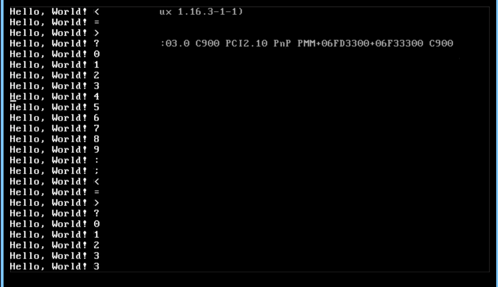
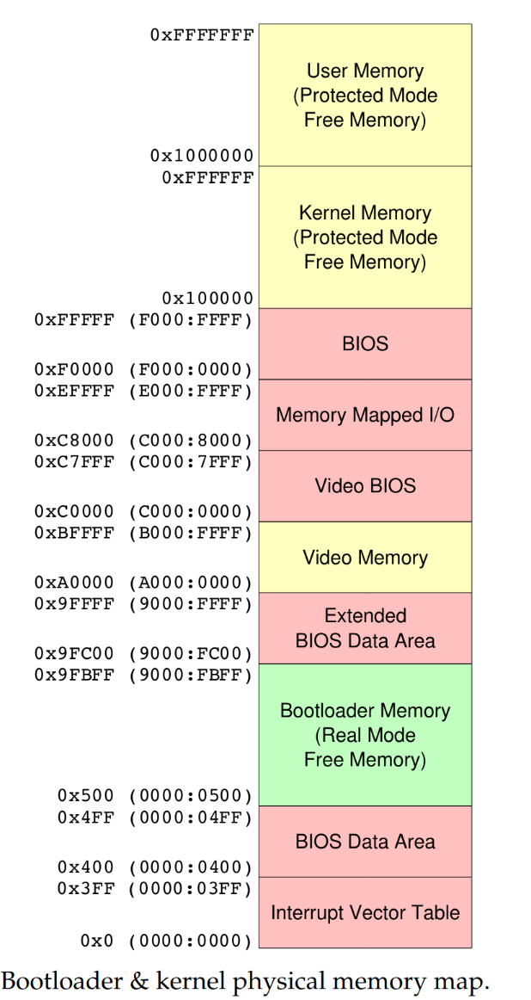
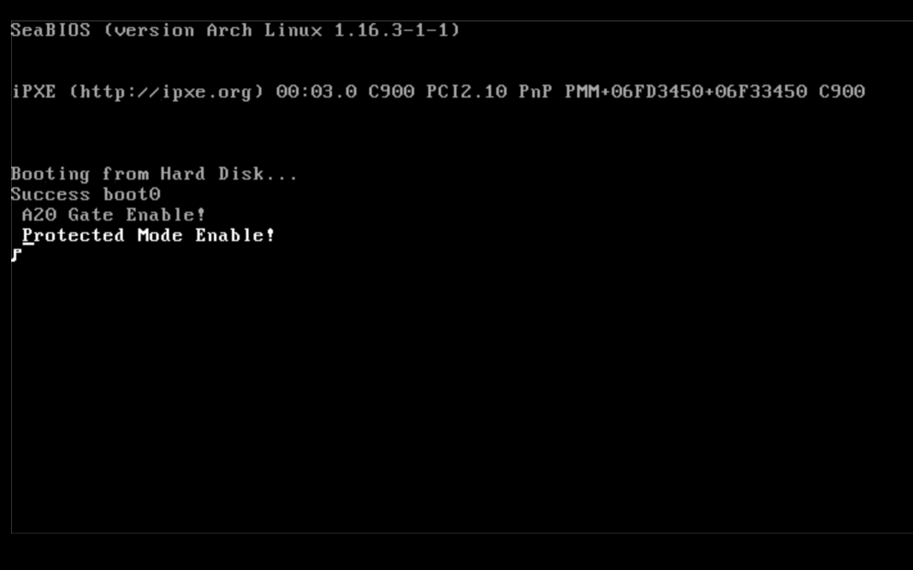
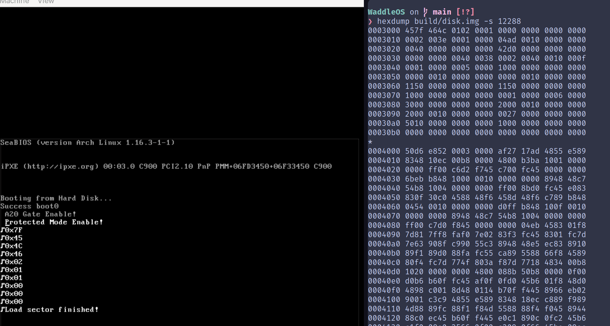
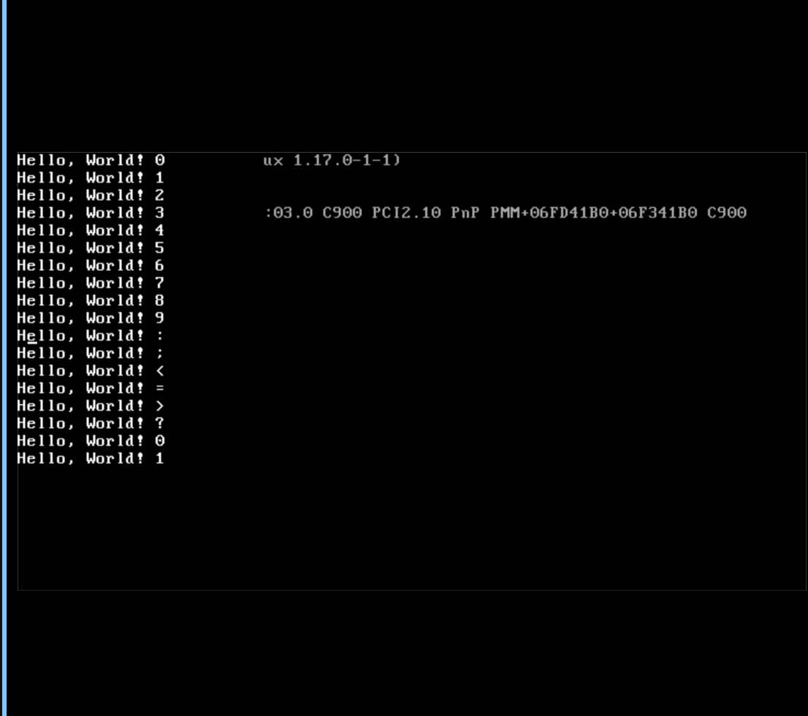

<!--PUBLISH-->
# Waddle OS -- Bootloader Bare Bones

I've finally started my OS-dev project. In the effort of trying to document what I learn, I'm going to try to use this blog more frequently as a means of writing to an audience about the new stuff I learn.

You can find the source code [here](https://github.com/IshDeshpa/WaddleOS). I'm calling it WaddleOS because it's my first baby steps towards an operating system but also because of the Linux mascot being a penguin.

I had to build a cross compiler for i686 first by pulling gcc and binutils-gdb. i686 is a 32-bit architecture, while x86_64 is a 64-bit architecture.

I got a basic VGA terminal working through a little bit of code in term.c. This is simply following the [Bare Bones tutorial published on the OSdev wiki](https://wiki.osdev.org/User:Zesterer/Bare_Bones). I added a little bit of code to make it scroll on overflow instead of reset to the beginning.



Now, I'm gonna shift my focus to getting a 64-bit kernel operational before I start implementing basic threading. I want this project to eventually develop into a full-fledged OS (big dreams, but we gotta start small).

I'll have to recompile gcc to support 64-bit, then boot into protected mode, set up some stuff, then boot into long mode. I also really want to write a 64-bit capable bootloader, but may end up using Limine just to start out.

> Protected mode must be entered before activating long mode. A minimal protected-mode environment must be established to allow long-mode initialization to take place. This environment must include the following:
>
>    A protected-mode IDT for vectoring interrupts and exceptions to the appropriate handlers while in protected mode.
>    The protected-mode interrupt and exception handlers referenced by the IDT.
>    Gate descriptors for each handler must be loaded in the IDT.

>    --AMD64 docs, volume 2, section 14.4 (Enabling Protected Mode), 24593 Rev. 3.10 February 2005

[This guide](http://www.osdever.net/tutorials/view/the-world-of-protected-mode) helps a lot. I think I'm gonna start with a segmented memory model and then switch to paging later on. Note that a lot of this is me just learning x86 stuff. The previous OS project I did was PintOS in my Operating Systems class, and while good, I feel like I still have a ways to go to truly say I understand every bit of the stack.

-----

Ok. I've painstakingly gone through all the bits in the global descriptor table entries for the code section and data section (which, for some reason,have the same base address and segment limit, so do they just overlap each other completely???) and finished setup for the gdt stuff. _In theory_, I've successfully entered protected mode. How do I know I have done it successfully? I have no clue. The code functions the same as before.

I _think_ the way it works is that:

- We start in 16-bit real mode
- We configure segments to be able to jump to 32-bit protected mode
- We scrap the segments for paging and jump to 64-bit "long mode" (not sure if the paging mode and the 64-bit mode are related)

-----

An update from a few days later. First, I tried to scrap my bootloader and do UEFI. From what I understand, UEFI is basically a souped up piece of firmware that does a lot of the traditional bootloader stuff for you so you don't have to. Then, as long as you properly format a "UEFI application" such as your kernel loader, you can just run it on the PC.

But this was a bit confusing and I didn't like the fact that a lot of the main initialization was being abstracted away from me. Luckily, I found [this Carnegie Mellon OS project](https://www.cs.cmu.edu/~410-s22/p4/p4-boot.pdf) that explained a lot of the basic boot stuff. I'll go over it briefly here so I can reinforce my understanding.

First sector (sector 1) of the disk is where your bootloader lives. It has to be 512 bytes at the max, which means you probably don't have enough space to actually do all of your bootloading. Thus, we do some initialization and read from sector 2 to load "boot1" which is the second-stage bootloader. This is what'll do all the protected mode stuff that I talked about earlier (gonna have to write all of that again now that I've started over).



As you can see in the example memory map, 0x4FF to 0x9FBFF is reserved for bootloader memory. The CMU project decides "hey my kernel isn't gonna grow over 640kB, so I'm going to just load the entire kernel into bootloader memory, switch to protected mode, and then move the kernel to actual kernel memory". If I want to scale the kernel though, I'm going to need to load directly into kernel memory, so I need to figure out how to do that. The direct problem here is that protected mode can't do BIOS disk interrupts, while real mode can't load beyond the 1MB barrier. So unless I want to switch back and forth between protected and real mode a bunch, there needs to be another way to both interact with BIOS and load beyond 1MB.

> If your kernel is bigger (or is expected to grow bigger) than this, you'll probably prefer to have the kernel above the 1MB barrier, which means you need to activate A20 gate and switch to Unreal Mode to load the kernel (with A20 alone, you cannot have more than 64K above 1MB). 
- [OSDev to the rescue](https://wiki.osdev.org/Rolling_Your_Own_Bootloader#Where_will_you_load_your_kernel?)

I still need to load stuff via BIOS interrupts into a buffer below temporarily and then transfer it beyond 1MB, but "A20 Gate" and "Unreal Mode" allow me to load a bunch of stuff above 1MB.

_Editor's Note: I swear to god; who designed this. This is like years of technical debt and poor decision making stacked on one another. Why can't x86 be better. Maybe I'll do an ARM system after this._

-----

I've been scammed. Unreal mode is just real mode with a broken 64kb limit.

Anyways, after a lot of finicky debugging, I managed to get protected mode working with the A20 gate enabled. My last bug took me two hours to solve and consisted of me accidentally putting "word" where there should have been a "byte" in the GDT.

I also spent some time switching from CHS (cylinder, head, sector) addressing to LBA (logical block addressing). There was no real need to do this but I felt that CHS was a remnant of a bygone era of hard drives with spinners. Also probably could improve access time.

All that was needed to get this working was to enable the Int 13h extension and set up a disk address packet in memory (see [this](https://wiki.osdev.org/Disk_access_using_the_BIOS_(INT_13h)#LBA_in_Extended_Mode)). The bug here was that I was trying to read 16 sectors from disk; which just failed the interrupt (carry bit was set). Why? I have no clue. After changing to 1 sector it started working. Perhaps the disk image wasn't large enough?

I also decided to load stage 2 from sector 5. The reason behind this was that I wanted to try making the bootloader ext4 compliant (at some point, maybe not now), and ext4 reserves sector 5 for a stage 2 bootloader according to [this](https://archive.kernel.org/oldwiki/ext4.wiki.kernel.org/index.php/Ext4_Disk_Layout.html#Special_inodes). For now though, I'll be loading the stage 2 bootloader from sector 5 and then loading the rest of the kernel from known sector 12 (which will eventually turn into some filesystem driver figuring out where the bootloader file is located on disk).

Finally, I added in some C. My stage 2 bootloader now compiles both boot1.S and the VGA terminal driver I wrote earlier; so now I can print to the screen "protected mode enabled"! I had to add a linker script and some extra bullshit to make building boot1 more complicated, but it was worth it because now I can write C.



So now I have boot0.S which loads 1 sector (boot1) from 5 into memory,and then jumps to it. Then, boot1.S will enable the A20 gate and protected mode. Now I need to load the kernel itself through the multiboot spec. Apparently multiboot is a open-source operating system standard for loading a kernel; a "multiboot-compliant" kernel should be able to be loaded by any "multiboot-compliant" bootloader even if there are slight differences of implementation from bootloader to bootloader.

~The multiboot header specifies certain flags that need to be handled by the bootloader. Of particular note is bit 16, which specifies whether the load addresses are specified by the binary or not. Flag 16 not being there, in essence, means that the kernel won't tell me where it wants to go. This is optimal because my bootloader can put it wherever is most convenient.~

~> If bit 16 in the ‘flags’ word is set, then the fields at offsets 12-28 in the Multiboot header are valid, and the boot loader should use them instead of the fields in the actual executable header to calculate where to load the OS image. This information does not need to be provided if the kernel image is in ELF format, but it must be provided if the images is in a.out format or in some other format. Compliant boot loaders must be able to load images that either are in ELF format or contain the load address information embedded in the Multiboot header; they may also directly support other executable formats, such as particular a.out variants, but are not required to.~

But wait! There's a newer version of multiboot with a completely different structure called multiboot2! I've been attracted to use this. First, we poach [multiboot2.h](https://www.gnu.org/software/grub/manual/multiboot2/multiboot.html) from the GRUB source. This provides us with all the necessary structures and fields to embed within the multiboot header.

[multiboot2](https://www.gnu.org/software/grub/manual/multiboot2/multiboot.html) seems to work with a tag-based system for most of its fields; where each field can be in whatever order and the tag specifies the type, flags, and size of the tag.

> Tags constitutes a buffer of structures following each other padded when necessary in order for each tag to start at 8-bytes aligned address. Tags are terminated by a tag of type ‘0’ and size ‘8’. Every structure has following format:
```
        +-------------------+
u16     | type              |
u16     | flags             |
u32     | size              |
        +-------------------+
```
So implementing this on the bootloader end is probably just iterating through these tags and doing whatever tag-specific behavior is required. Luckily, because of my change from earlier, I can now write this in C.

-----

In order to implement my multiboot parser I first need to be able to actually load a sector from the kernel. Now, doing this took a lot more time than initially planned for. 

For a period of three days, I neglected to RTFM and instead assumed that a jump directly to real mode from 32-bit protected mode would also result in a shift back to 16-bit instructions. In reality, it only means that we go into 32-bit real mode, which is why my instructions were being executed as if they were 32 bits. This cost me a fair amount of time, but I now know I need to shift to 16-bit protected mode and then 16-bit real mode to be in 16-bit real mode.

The next bug is calling convention issues. x86 calling convention requires that A) some registers (EAX, ECX, EDX) can be modified and B) some registers (EBX, ESI, EDI) must stay intact. As with any assembly method called from C, I needed to respect the calling convention. After a bit of tweaking where I was loading in arguments from the stack, I was able to get a successful dump to the terminal from the disk buffer of the first few bytes of my kernel.



Yippee!

-----

Big timeskip. I have now finished my internship and return to this blog post as a sort of guide to finish writing the multiboot2 loader.

First thing I'm doing is writing an implementation of memcpy, memmove, and memset in my own string.c. If this gets too hairy I can switch to like musl or something, but I really wanna try to reinvent the wheel with this project as much as I can (in a good way).

To start, I added the necessary (probably more than necessary) tags to my kernel:

```
.section .multiboot
multiboot_hdr:
  .long MULTIBOOT2_HEADER_MAGIC
  .long MULTIBOOT_ARCHITECTURE_I386
  .long multiboot_hdr_end - multiboot_hdr
  .long -(MULTIBOOT2_HEADER_MAGIC + MULTIBOOT_ARCHITECTURE_I386 + multiboot_hdr_end - multiboot_hdr)
multiboot_tag_align:
  .align MULTIBOOT_TAG_ALIGN
  .word MULTIBOOT_HEADER_TAG_MODULE_ALIGN
  .word 0
  .long 8
multiboot_tag_console_flags:
  .align MULTIBOOT_TAG_ALIGN
  .word MULTIBOOT_HEADER_TAG_CONSOLE_FLAGS
  .word 0
  .long 12
  .long 3
multiboot_tag_framebuffer:
  .align MULTIBOOT_TAG_ALIGN
  .word MULTIBOOT_HEADER_TAG_FRAMEBUFFER
  .word 0
  .long 20
  .long 0
  .long 0
  .long 32
multiboot_hdr_end:
  .align MULTIBOOT_TAG_ALIGN
```

I then was able to loop and find the magic number in my bootloader properly. Pretty straightforward.

What's not super clear to me is if I should switch to long (64-bit) mode before or after I do the parsing of the ELF header. I know the ELF header has important information like where I should load the OS (physical and virtual address), size, offset. But if the ELF is a 64-bit ELF then each field is 64-bits, making it inconvenient to read if I'm in 32-bit mode.

```
0000000 177   E   L   F 002 001 001  \0  \0  \0  \0  \0  \0  \0  \0  \0
```

A hexdump tells me that after the "ELF" magic number, there's a 002, which means that the kernel ELF is indeed 64-bit. Which is intended. But do I need to switch to long mode before parsing this?

[This post](https://stackoverflow.com/a/15141453) explains that uint64_t does not require the existence of a 64-bit system, so I'm in the clear for parsing.

Another question I had is why I even need the multiboot2 information at all. The ELF encodes different PT_LOAD sections that each tell me how many bytes to load from where to where. Conversely, the multiboot information just tells me random hardware support shit.

So I decided to not worry about multiboot until later (or never) and start with just some ELF parsing, grabbing the PT_LOAD sections and putting their info in this struct:
```
typedef struct {
  size_t bytes;
  uint8_t *addr;
  size_t offset;
} load_info_t;
```

Then, all I had to do was load the required number of sectors into the disk buffer and memcpy them to the correct physical address. Now comes the switch to long mode.

*Long Mode:* First, you need to detect if long mode is available on your processor. But in order to detect if long mode is available, you must support the CPUID extended features. But in order to support CPUID extended features, you must support the CPUID instruction. So these three checks must be made in order to make sure it is possible to switch to long mode.

Then comes paging. We need to set up a 4-level page table (4-level because it's pretty standard to use on AMD64) to switch to long mode. The recommendation of the [OSDev Wiki](https://wiki.osdev.org/Setting_Up_Long_Mode) is that I map only the first 2MB and then do the rest in 64-bit long mode. Time for some math.

If I have a four level 64-bit page table, there are 512 entries per page table, each entry 64-bits (8 bytes). 
- P0 is the actual pages.
- P1 holds entries that correspond to pages, each page being 4096 bytes. 4096 * 512 = 2097152 (0x200000) bytes addressable or 2MB
- P2 holds entries that correspond to P1s, with 512 PTEs -> 4096 * 512^2 = 1073741824 (0x40000000) bytes addressable or 1GB
- P3 holds entries that correspond to P2s, with 512 PTEs -> 4096 * 512^3 = 549755813888 (0x8000000000) bytes addressable or 512GiB
- P4 holds entries that correspond to P3s, with 512 PTEs -> 4096 * 512^4 = 2.8147498 * 10^14 (0x1000000000000) bytes addressable or 256TiB

So 2MB is basically one full P0. I would put the page tables at 0x1000, which is where the OSDev wiki recommends, but my boot1 is located there. So I'm going to locate P3 at 0x10000. Note that this is just a temporary location for the page table in boot1 memory, until I jump to the kernel code, where I will actually initialize virtual memory with a separate page table.

After setting up the page table and grabbing the entry point address from the ELF header, I was successfully able to jump to the kernel's entry point:


Success! Now onto the actual writing of the OS...

*Editor's note: god i hope i never have to touch this again (foreshadowing)*
